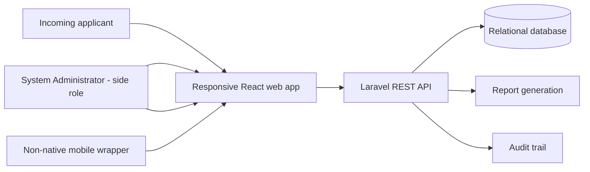

# Project Overview

**Purpose:** Define the academic problem, intended product, users, inputs, and boundaries.  
**Status:** PROVISIONAL pending client/adviser review.  
**Basis:** Capstone proposal, Chapter 1; React roadmap, Sections 1-2.  
**Owner:** Capstone team and academic adviser.  
**Last updated:** 2026-07-29.
**Related IDs:** FR-01-FR-10, BR-01-BR-12, D-001, D-004, D-007-D-008, D-020.
**Open questions:** OQ-001-OQ-012 and OQ-014 in [22-OPEN-QUESTIONS.md](22-OPEN-QUESTIONS.md).

## Product statement

The Psychometric-Based College Course Recommendation System Using Student Profiling is a responsive web decision-support system for incoming Tagoloan Community College applicants and the authorized Guidance/Psychometrician/Admin role. It combines:

- student profile and application information;
- an official admission examination result encoded, imported, or verified by the authorized Guidance/Psychometrician/Admin role; and
- responses to a psychometrician-approved RIASEC assessment.

The output is a reproducible, ranked, explainable set of recommendations limited to current TCC programs and applicable admission rules. Recommendations guide a decision; they do not enroll an applicant or make a final course assignment.

## Intended users

- Student Applicant
- Guidance/Psychometrician/Admin
- System Administrator (limited side role)

The three-role catalogue is APPROVED under D-007. D-020 confirms that the
combined Admin entry is one role type, not one person: multiple authorized
guidance counselors and psychometricians may each use an individual account
assigned to that role. Whether one account may hold multiple different role
types, exact approval steps, action-level differences, and Admin
authentication details remain open in OQ-007/OQ-008.

## Objectives

1. Organize applicant, official examination, assessment, and recommendation information.
2. Provide a structured RIASEC assessment and preserve the instrument/scoring version used.
3. Apply approved admission rules consistently.
4. Generate course recommendations with understandable reasons and eligibility status.
5. Support Admin review and formal reporting.
6. Produce test and evaluation evidence without overstating unperformed work.

## System context (PROPOSED)

## Evidence boundary

The proposal uses past tense for development, testing, deployment, review, and launch, but the repository contains only a default frontend scaffold and no corresponding evidence. Those activities are not treated as completed. See [Progress Tracker](17-PROGRESS-TRACKER.md) and [Defense Readiness](21-DEFENSE-READINESS.md).

Related documents: [Scope](03-SCOPE-AND-SUCCESS-CRITERIA.md), [Architecture](07-SYSTEM-ARCHITECTURE.md), [Recommendation Engine](09-RECOMMENDATION-ENGINE.md).
