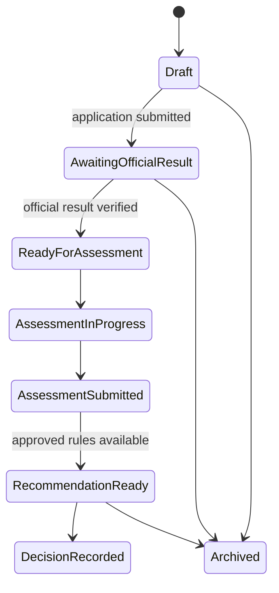

# Business Rules

**Purpose:** Separate approved behavior from unresolved policy and technical recommendations.  
**Status:** PROVISIONAL; blocked rules are not implementable.  
**Basis:** Proposal scope and roadmap, Sections 5 and 18.  
**Owner:** Guidance/Psychometrician/Admin according to approved institutional authority; System Administrator owns only approved technical controls.  
**Last updated:** 2026-07-27.  
**Related IDs:** BR-01-BR-12, D-004-D-006, R-001-R-006.  
**Open questions:** OQ-002-OQ-010.

| ID | Rule | Status |
|---|---|---|
| BR-01 | The system provides guidance; the applicant retains the final course decision. | PROVISIONAL, source-supported |
| BR-02 | Only authorized Guidance/Psychometrician/Admin users may create, import, verify, reject, or correct official exam results. | PROPOSED pending official exam workflow approval |
| BR-03 | A student may view only their own official result and cannot mark it verified. | PROPOSED |
| BR-04 | Eligibility uses the official score field, comparison direction, threshold, board-course classification, and effective rules approved for the admission cycle. | BLOCKED |
| BR-05 | “2.50 or better” must not be hardcoded until its scale, comparison direction, inclusivity, and course-specific exceptions are confirmed in writing. | BLOCKED |
| BR-06 | Only an approved/effective questionnaire version can accept new sessions; submitted sessions preserve their original version. | PROPOSED |
| BR-07 | The authoritative instrument and question-to-dimension/scoring mapping require psychometrician approval. | BLOCKED |
| BR-08 | Course RIASEC profiles, weights, explanations, and effective dates require psychometrician approval and version history. | BLOCKED |
| BR-09 | Recommendation runs snapshot inputs and all governing versions and are not recalculated in place. | PROPOSED |
| BR-10 | The 70% RIASEC / 30% academic blend is configurable, versioned, and PROVISIONAL; it is not approved policy. | PROVISIONAL |
| BR-11 | The number of recommendations shown is configurable and PROVISIONAL. | PROVISIONAL |
| BR-12 | ML may not bypass eligibility rules or be represented as implemented without approved data, labels, metrics, validation, versioning, and a model card. | PROPOSED |

## Application state (PROPOSED)

The precise state names and transitions require workflow approval. Related: [Open Questions](22-OPEN-QUESTIONS.md), [Recommendation Engine](09-RECOMMENDATION-ENGINE.md).
