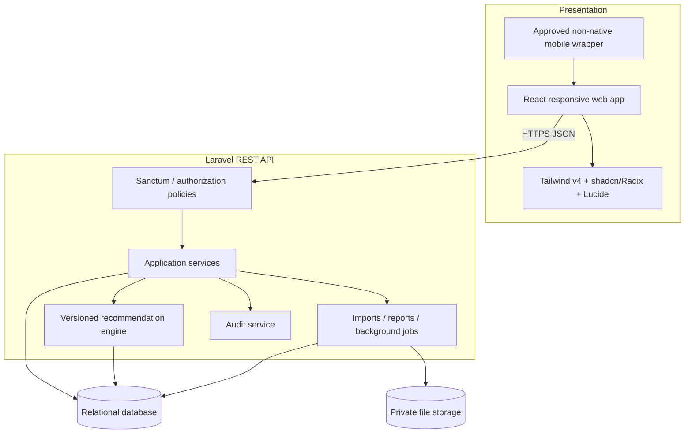
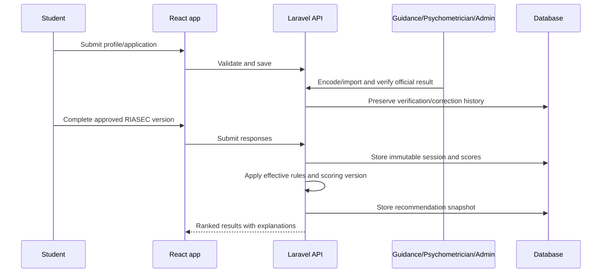

# System Architecture

**Purpose:** Define the provisional technical boundaries and runtime flow.  
**Status:** PROPOSED.  
**Basis:** Roadmap, Sections 1 and 6; ADR-001-ADR-003.  
**Owner:** Capstone technical lead.  
**Last updated:** 2026-07-27.  
**Related IDs:** D-001-D-004, D-007-D-008, NFR-02-NFR-10.  
**Open questions:** Database/hosting decision OQ-001, integrations OQ-012, and mobile wrapper OQ-014.

## Architecture baseline

- `apps/web`: React + Vite + TypeScript presentation layer.
- The same responsive web codebase is the sole feature implementation and will be delivered through a non-native mobile wrapper after OQ-014 selects the method.
- APPROVED UI system: Tailwind CSS v4 through the official `@tailwindcss/vite` plugin; shadcn/ui with Radix as its explicit primitive base; Lucide React icons.
- Forms and API state: React Hook Form + Zod, TanStack Query, and TanStack Table for complex applicant/report tables.
- Laravel REST API: validation, authorization policies, services, deterministic recommendation orchestration, jobs, reporting, audit, and integrations.
- Relational system of record: MySQL 8 or PostgreSQL, BLOCKED by hosting decision.
- Laravel Sanctum secure cookie authentication when frontend/API topology permits; alternate token topology requires an approved security review.
- Large generated or uploaded files stored as controlled file references, not database base64.



## End-to-end workflow (PROPOSED)



Application code remains unimplemented. See [Database Design](08-DATABASE-DESIGN.md), [API Contract](10-API-CONTRACT.md), and [Deployment Plan](20-DEPLOYMENT-PLAN.md).

## Frontend organization (APPROVED)

```text
src/components/ui/                 Generated and customized shadcn/ui primitives
src/components/shared/             Reusable application-level components
src/features/<feature>/components/ Components owned by one business module
```

Application-level shared components initially include `PageHeader`, `StatusBadge`, `LoadingState`, `EmptyState`, `ErrorState`, `ConfirmActionDialog`, `CollectionToolbar`, and `DataTableToolbar`. `CollectionToolbar` serves card, lane, catalogue, and document-library search/filter surfaces; `DataTableToolbar` is reserved for real tables. D-001 is approved; feature work remains subject to the other gates in [Open Questions](22-OPEN-QUESTIONS.md).
