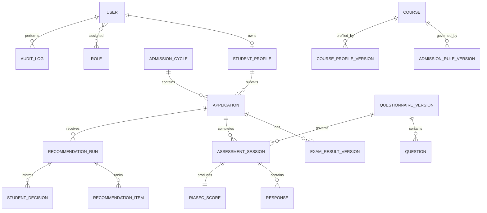

# Database Design

**Purpose:** Define the conceptual data model and corrections required before migrations.  
**Status:** BLOCKED on D-003/OQ-001 and institutional data decisions.  
**Basis:** Roadmap, Section 7 and Appendix B; proposal database conflict.  
**Owner:** Capstone backend lead; data fields approved by TCC owners.  
**Last updated:** 2026-07-27.  
**Related IDs:** D-003, BR-02-BR-09, NFR-03-NFR-07.  
**Open questions:** OQ-001, OQ-003, OQ-006-OQ-009.

## Database decision

Use MySQL 8 for ordinary Hostinger shared/cloud hosting. Use PostgreSQL only after confirming a VPS or compatible managed PostgreSQL service. The decision is BLOCKED until the exact plan and supported versions/extensions are documented. Laravel migrations become authoritative only after D-003 is approved.

## High-level ERD (PROPOSED)

## Required design corrections

1. Confirm whether `applicant_no` is permanent or admission-cycle-specific. If cycle-specific, store it on `applications`, not `student_profiles`.
2. Add explicit version, status, approval, effective-from, effective-to, and supersession controls to course admission rules.
3. Add approval/effective lifecycle fields to questionnaire versions.
4. Preserve each exam result correction as history; never overwrite the only official record.
5. The approved role catalogue contains exactly three roles. Decide whether one account can hold multiple roles before choosing `role_id` versus a user-role join table.
6. Keep submitted assessments, calculated scores, recommendation input snapshots, and ranked results immutable.
7. Store rule, questionnaire, scoring, course-profile, and algorithm version references on recommendation runs.
8. Define privacy-driven retention/anonymization and deletion behavior before foreign-key cascades.

No SQL schema or migrations are approved or implemented. Related: [Security and Privacy](12-SECURITY-AND-PRIVACY.md), [ADR-003](adr/ADR-003-DATABASE.md).
