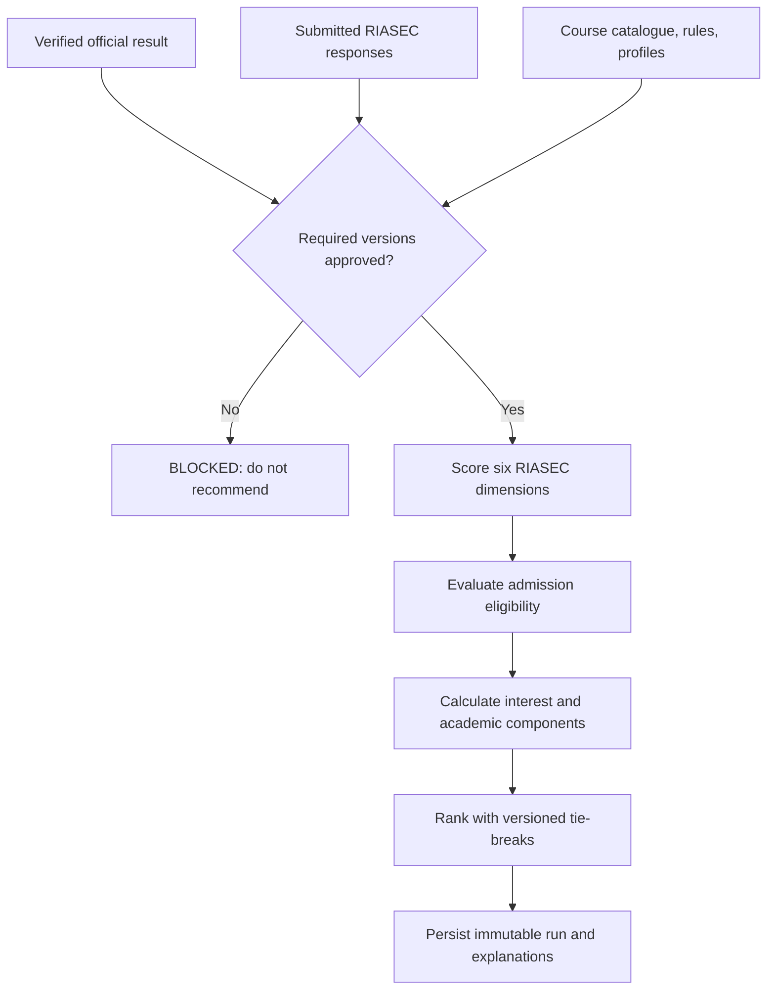

# Recommendation Engine

**Purpose:** Define a defensible, versioned recommendation baseline and ML gate.  
**Status:** PROVISIONAL; domain inputs are BLOCKED.  
**Basis:** Proposal recommendation objective; roadmap, Section 8; ADR-004.  
**Owner:** Psychometrician (validity) and capstone technical lead (implementation).  
**Last updated:** 2026-07-26.  
**Related IDs:** FR-05-FR-08, BR-04-BR-12, D-004, D-006.  
**Open questions:** OQ-002-OQ-006 and OQ-011.

## Mandatory baseline

The MVP must use deterministic, explainable rules:

1. Load the verified official exam result and its version.
2. Load the submitted approved questionnaire and scoring version.
3. Calculate the six RIASEC dimensions using the psychometrician-approved mapping.
4. Load effective course eligibility rules and approved course RIASEC profiles.
5. Evaluate eligibility without allowing interest fit or ML to bypass mandatory admission rules.
6. Calculate versioned academic and interest components.
7. Apply a configurable blend and tie-break policy.
8. Store an immutable input snapshot, component scores, exclusions, rank, versions, and explanation.

## Provisional scoring

The roadmap's `final = 0.70 * interest + 0.30 * academic` is a PROVISIONAL example only. Weights, normalization, missing-value behavior, tie-breaks, conditional eligibility, and displayed recommendation count must be configurable, versioned, and approved. The 2.50 rule must not be encoded until its direction and boundaries are confirmed.

## Instrument gate

The proposal includes both a 42-item binary RIASEC worksheet and a separate 18-item Career Assessment. The 42-item binary form is the PROVISIONAL recommendation, but no question-to-dimension mapping may be invented. Psychometrician approval must include source/rights, exact items, response values, scoring, interpretation, lifecycle, and validation cases.

## ML gate

Decision Tree and Random Forest are DEFERRED unless all exist:

- approved target label and feature schema;
- lawful, representative labelled dataset and data provenance;
- train/validation/test split and leakage controls;
- baseline comparison and approved metrics;
- fairness/error analysis and limitations;
- versioned artifact, model card, approval, monitoring, and rollback.

If ML remains an academic objective, obtain approved data or formally revise the manuscript. Never describe ML as implemented without evidence.

Related: [ADR-004](adr/ADR-004-RECOMMENDATION-APPROACH.md), [Testing Strategy](13-TESTING-STRATEGY.md).

