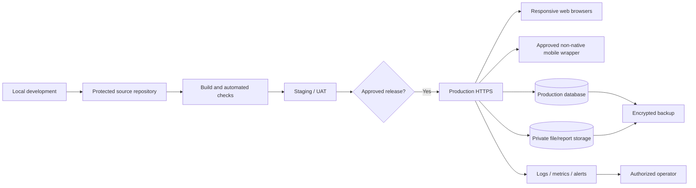

# Deployment Plan

**Purpose:** Define secure local, staging/UAT, and production readiness without claiming deployment.  
**Status:** BLOCKED on hosting/database and operational ownership.  
**Basis:** Proposal Hostinger intent; roadmap, Section 15.  
**Owner:** TCC IT/authorized operator and capstone technical lead.  
**Last updated:** 2026-07-27.  
**Related IDs:** D-003, NFR-05-NFR-10, R-003, R-008-R-009.  
**Open questions:** Exact Hostinger plan, domain, runtime/database support, deployment owner, RPO/RTO, monitoring, incident contact, and OQ-014 mobile-wrapper method/distribution.

## Topology (PROPOSED)

## Environment controls

- Local: synthetic data only; documented setup; no production secrets.
- Staging/UAT: production-like runtime, anonymized/synthetic data, separate credentials/storage, controlled testers.
- Production: HTTPS, least privilege, debug disabled, secure secrets, restricted admin tools, monitoring, audit, backups, and incident procedure.
- Mobile wrapper: package the same approved web release only after OQ-014; maintain platform signing/store metadata outside the application repository as appropriate and never embed server secrets.

## Release gates

1. Approved architecture/database and reproducible build.
2. Passing required tests with no critical open defects.
3. Reviewed migrations, data backup, restore evidence, and rollback rehearsal.
4. Environment/secret/access review and dependency/security checks.
5. Approved privacy notice, retention, support, incident, and account procedures.
6. Staging/UAT sign-off and explicit production launch approval.
7. Release tag, changelog, smoke test, and post-release monitoring.
8. When mobile delivery is included, wrapper parity, signing/distribution, privacy disclosure, deep-link, auth, download, print/share, update, and target-device checks pass.

Recommended backup schedules and recovery targets remain PROPOSED until the host and institutional needs are confirmed. No staging, production, UAT, backup restore, SUS, or launch has been completed.
