# Role-Based Feature Roadmap

**Purpose:** Track every screen for the approved three-role system: Student Applicant, Guidance/Psychometrician/Admin, and System Administrator side role, plus public/shared surfaces.  
**Status:** APPROVED three-role catalogue; feature details remain PROVISIONAL/BLOCKED by their listed dependencies.  
**Basis:** [Functional Requirements](05-FUNCTIONAL-REQUIREMENTS.md), [Stakeholders and Roles](04-STAKEHOLDERS-AND-ROLES.md), [API Contract](10-API-CONTRACT.md), [UI/UX Plan](11-UI-UX-PLAN.md), and [End-to-End Delivery Checklist](23-END-TO-END-DELIVERY-CHECKLIST.md).  
**Owner:** Capstone product/frontend lead; permissions require approval from the responsible TCC owners.  
**Last updated:** 2026-07-29.
**Related IDs:** D-001, D-007-D-008, D-020, FR-01-FR-10, US-01-US-16, OQ-002-OQ-010, OQ-012, OQ-014, TC-01-TC-15.
**Open questions:** OQ-007/OQ-008 retain account/action details; OQ-014 controls mobile-wrapper delivery; other dependencies are listed per feature.

## Tracking rules

- A feature remains `[ ]` until its UI, API, policies, tests, documentation, and required stakeholder review are complete.
- Change `[ ]` to `[x]` only with an evidence-log entry.
- `BLOCKED` means an institutional answer is required. `NOT STARTED` means approved dependencies are available but implementation has not begun.
- A page mockup alone is not an implemented feature.
- Route groups are PROPOSED organizational names, not an approved URL contract.
- Navigation visibility is convenience only; Laravel policies and ownership checks must enforce access.
- Loading, empty, error, blocked, permission-denied, responsive, keyboard, and retry states are part of each feature's completion criteria.
- `GP-*` and `AT-*` are domain feature identifiers owned by the single Guidance/Psychometrician/Admin role type; they do not represent separate application roles.
- “Single” or “combined” Admin means one role type and portal, not one person.
  Multiple authorized guidance counselors and psychometricians each use an
  individual account assigned to that shared role under D-020.

## Overall status

| Role area | Features | Current status | Main blockers |
|---|---:|---|---|
| Public and account access (not a role) | 8 | IN PROGRESS | PUB-01 is OUT OF SCOPE; portal login/session/logout and baseline role enforcement are implemented, while registration, recovery, account states, detailed policies, browser evidence, and approval remain blocked/pending |
| Shared authenticated shell (all roles) | 7 | BLOCKED | OQ-007/OQ-008 account/action details |
| Student Applicant | 11 | BLOCKED | OQ-002-OQ-006, OQ-009-OQ-010 |
| Guidance/Psychometrician/Admin | 20 | BLOCKED | OQ-002-OQ-010 |
| System Administrator side role | 10 | BLOCKED | OQ-001, OQ-007-OQ-008, OQ-012 |
| Cross-role/delivery completion | 7 | BLOCKED | All applicable decisions, OQ-014, and test gates |

No application feature in this document is currently COMPLETED.

Approved application-role count: **3**. Public pages and shared components are delivery surfaces, not additional roles.

## Recommended implementation order

```mermaid
flowchart LR
    A[1. Shared UI foundation] --> C[2. Access and authentication]
    C --> D[3. Role-aware shell]
    D --> E[4. Admin panel UI]
    E --> F[5. Admin official-exam workflow]
    F --> G[6. Student profile/application]
    G --> H[7. RIASEC workflow]
    H --> I[8. Course/rule governance]
    I --> J[9. Recommendations and reports]
    J --> K[10. System Administrator final role panel]
    K --> L[11. Cross-role, wrapper, and UAT hardening]
```

The combined Admin panel is the first role-specific UI slice. Its documented
official-result workflow precedes assessment/recommendation integration so
recommendations never depend on a student-entered official score. The System
Administrator role panel is the final role-specific slice. Protected behavior
remains blocked until its listed institutional decisions are approved.

## Public and account-access features

| Done | ID | Screen/feature | Proposed route group | Purpose | Depends on | Status | Completion evidence |
|---|---|---|---|---|---|---|---|
| [ ] | PUB-01 | Public homepage | none | Public marketing/introduction surface. | D-010 | OUT OF SCOPE | Explicit user direction removed the public introduction from the MVP. |
| [ ] | PUB-02 | Privacy and profiling notice | `/privacy` | Explain collection, official-result source, RIASEC profiling, rights, retention, and contacts. | OQ-012/DPO review | BLOCKED | Approved notice, readable layout, version/date, link and accessibility tests. |
| [ ] | AUTH-01 | Registration | `/register` | Create an applicant account using approved fields and privacy flow. | OQ-006, OQ-007, OQ-012; D-002 | BLOCKED | UI/API validation, duplicate prevention, safe errors, tests. |
| [ ] | AUTH-02 | Portal sign-in | `/student/login`, `/admin/login`, `/system-admin/login` | Authenticate approved users and route them safely by authorized role without client-side role selection. | D-010-D-012/D-020; OQ-007/OQ-008; D-002 | IN PROGRESS; PRODUCTION POLICY BLOCKED | Shared RHF/Zod sign-in and Laravel Sanctum cookie authentication are connected. CSRF bootstrap, session rotation/restoration, provisional throttling, reusable role middleware, server-confirmed three-role portal entry, wrong-role denial, multiple individual accounts holding the shared Admin role, protected routes, actionable errors, safe local Admin provisioning, opt-in environment-backed local accounts, 126 frontend tests, 20 Laravel tests, and a live HTTP flow pass. Registration, recovery, approved account states/action controls, production topology, browser evidence, and stakeholder approval remain pending. |
| [ ] | AUTH-03 | Password recovery/reset | `/forgot-password`, `/reset-password` | Recover an account without exposing whether unrelated accounts exist. | Approved notification/recovery channel | BLOCKED | Token expiry/reuse tests, actionable UI, audit as approved. |
| [ ] | AUTH-04 | Account verification/status | `/account-status` | Explain pending, active, locked, inactive, or verification-required status. | OQ-007/OQ-008 | BLOCKED | Approved states, recovery guidance, policy tests. |
| [ ] | AUTH-05 | Forbidden/not-found/session-expired states | shared error routes | Give safe recovery without revealing protected resources. | Auth/router foundation | IN PROGRESS; PRODUCTION POLICY BLOCKED | Focused `/forbidden`, `/session-expired`, and not-found recovery screens, semantic heading focus, functional return actions, server `401`/`403` portal-check mapping, and component tests are implemented. Detailed feature authorization, session-data preservation, browser evidence, and E2E tests remain pending. |
| [ ] | AUTH-06 | Logout | application shell | End the current server session and clear client state safely. | AUTH-02 | IN PROGRESS | Server logout invalidates the session, regenerates CSRF state, clears client auth state, and returns to the matching portal. Laravel/frontend tests and live logout-to-401 evidence pass; browser rendering and production-topology review remain pending. |

## Shared authenticated features

Exact visibility remains PROVISIONAL until OQ-007/OQ-008 are approved.

| Done | ID | Screen/feature | Proposed route group | Purpose | Depends on | Status | Completion evidence |
|---|---|---|---|---|---|---|---|
| [ ] | SHR-01 | Responsive application shell | `/student`, `/admin`, `/system-admin` (UI routes; final protected contract PROPOSED) | Provide desktop Sidebar, mobile Sheet, Breadcrumb, user menu, alerts, content layout, and persistent appearance preference. | D-001/D-019; approved route/role map | IN PROGRESS; PRODUCTION POLICY BLOCKED | Desktop Sidebar, left-opening mobile Sheet, sticky top bar, role navigation, labelled module search, semantic Breadcrumb, Radix user Dropdown Menu with sign-out, responsive grid, module entry/return, server-confirmed portal entry, and persistent accessible light/dark toggles on portal/workspace/recovery surfaces are implemented with component tests. Detailed feature authorization, browser responsive/keyboard/light-dark contrast evidence, and E2E tests remain pending. |
| [ ] | SHR-02 | Role-aware dashboard routing | `/app` | Send users to the correct authorized dashboard without trusting client roles. | OQ-007/OQ-008, policies | BLOCKED | Wrong-role/direct-API tests and safe fallback. |
| [ ] | SHR-03 | User profile/account settings | `/app/account` | Show approved identity fields and permitted account actions. | OQ-006/OQ-007/OQ-012 | BLOCKED | Ownership, editable/read-only field rules, tests. |
| [ ] | SHR-04 | Notification/feedback framework | application-wide | Use Alert for blockers/errors and Sonner only for non-critical feedback. | Approved notification policy | PROVISIONAL | Duplicate prevention, announcement/accessibility tests. |
| [ ] | SHR-05 | Global loading/empty/error/blocked states | application-wide | Provide reusable states without fake controls or data. | Shared components | IN PROGRESS - UI ONLY | Shared loading, empty, and retryable error components are available through every Admin route boundary and covered by route-state tests. Real API integration, blocked/stale behavior, browser evidence, and E2E tests remain pending. |
| [ ] | SHR-06 | Session and permission recovery | application-wide | Recover from expiration, forbidden actions, and stale role changes. | Auth/policies | BLOCKED | Retry/redirect/data-preservation tests. |
| [ ] | SHR-07 | Help, support, and user guidance | `/app/help` | Provide approved process help and support contacts. | OQ-008/OQ-012 | BLOCKED | Approved content and accessible navigation. |

## Student applicant features

Students can access only their own records. Official admission examination data is always read-only for students.

| Done | ID | Screen/feature | Proposed route group | Purpose | Depends on | Status | Completion evidence |
|---|---|---|---|---|---|---|---|
| [ ] | STU-01 | Student dashboard | `/student` | Show real application steps, blockers, statuses, and next allowed action. | SHR-01; approved workflow | IN PROGRESS - UI ONLY; PRODUCTION BLOCKED | D-015 prototype provides a functional next-action hero, six text-labelled journey stages through decision/report, recommended next step, Student-only actions, read-only result boundary, non-enrolment notice, responsive layout, search compatibility, and component/accessibility tests. Real API status data, approved workflow, browser review, ownership, and E2E evidence remain pending. |
| [ ] | STU-02 | Applicant profile | `/student` Profile & application module; dedicated route PROPOSED | Create/update approved personal and educational profile fields. | OQ-006/OQ-012 | IN PROGRESS - UI ONLY; PRODUCTION BLOCKED | D-015 prototype provides a mobile-first readable profile, completion feedback, editable RHF/Zod fields, labelled inline validation, explicit save/loading feedback, dirty-change protection, responsive controls, and loading/empty/retryable-error states. Approved fields, Laravel validation, ownership, persistence, conflict recovery, browser review, and E2E evidence remain pending. |
| [ ] | STU-03 | Admission-cycle application | `/student` Profile & application module; dedicated route PROPOSED | Create, review, submit, and view one application per approved cycle. | OQ-005/OQ-006; cycle model | IN PROGRESS - UI ONLY; PRODUCTION BLOCKED | D-015 prototype provides a synthetic application summary, completion checklist, review declaration, accessible submit confirmation, and read-only submitted state. Approved lifecycle/cycle model, duplicate-cycle enforcement, policy/API tests, browser review, and stakeholder acceptance remain pending. |
| [ ] | STU-04 | Official exam result/status | `/student` Official result module; dedicated route PROPOSED | View own result, provenance/verification status, and approved correction guidance. | OQ-002/D-005 approval | IN PROGRESS - UI ONLY; PRODUCTION BLOCKED | D-015 prototype provides an aligned title-description-breadcrumb header, responsive read-only summary, text-labelled verification state, source/reference metadata, verification timeline, correction-contact guidance, loading/empty/retryable-error states, Student-write denial coverage, role isolation, and automated accessibility coverage. Approved result format/status/correction guidance, production data/API ownership, browser review, privacy/E2E evidence, and stakeholder acceptance remain pending. |
| [ ] | STU-05 | RIASEC assessment introduction | `/student` Assessment module; dedicated route PROPOSED | Show approved instructions, notice, eligibility to begin, and active version. | OQ-003/OQ-004 | IN PROGRESS - UI ONLY; PRODUCTION BLOCKED | D-015 prototype provides an aligned responsive header, general expectations, synthetic version/readiness context, a non-diagnostic notice, acknowledgement and confirmation gates, functional session-opening feedback, inactive/loading/empty/retryable-error states, role isolation, and automated accessibility coverage. It contains no invented questionnaire items, response options, mappings, scoring, interpretations, or validation claims. Approved content/lifecycle, Laravel session APIs, ownership, browser review, psychometrician acceptance, and E2E evidence remain pending. |
| [ ] | STU-06 | RIASEC assessment session | `/student` Assessment module; dedicated session route PROPOSED | Answer, autosave, resume, review, and submit the approved instrument. | STU-05; OQ-003/OQ-004; scoring lifecycle | IN PROGRESS - UI ONLY; PRODUCTION BLOCKED | D-015 prototype opens from the acknowledged introduction and provides a responsive one-question flow, direct progress navigation, labelled synthetic response controls, local autosave/resume, save-and-exit, offline recovery, review/editing, incomplete-submit prevention, confirmation, stale-version recovery, locked completion, role isolation, and automated accessibility coverage. It performs no dimension mapping, scoring, interpretation, validation, or recommendation. Approved instrument/lifecycle, Laravel persistence/idempotency/ownership, keyboard/browser review, psychometrician acceptance, and E2E evidence remain pending. |
| [ ] | STU-07 | RIASEC result | `/student` Assessment module result state; dedicated route PROPOSED | Show approved six-dimension/top-code interpretation without diagnosis. | OQ-004; submitted session | IN PROGRESS - UI ONLY; PRODUCTION BLOCKED | D-015 prototype opens from the locked submitted-session state and provides a responsive read-only top-code summary, six labelled numeric dimension bars, leading-dimension order, result/session/assessment-version provenance, guidance limitations, loading/empty/retryable-error/preparing states, role isolation, and automated accessibility coverage. Synthetic values are not approved scoring, norms, interpretation, mapping, validation evidence, or production data, and no recommendation, eligibility, diagnosis, admission, or enrolment claim is made. Approved scoring/interpretation, Laravel ownership/API, browser review, psychometrician acceptance, and E2E evidence remain pending. |
| [ ] | STU-08 | Recommendation results | `/student` Course guidance module; dedicated route PROPOSED | Show ranked courses, eligibility, factors, explanations, and limitations. | OQ-002/OQ-005/OQ-009 | IN PROGRESS - UI ONLY; PRODUCTION BLOCKED | D-015 prototype provides responsive ranked cards, text-labelled requirement states, numeric match values, explanation factors, provenance, status filters, focused details, two-to-three-course comparison, assessment-result handoff, loading/empty/retryable-error/preparing states, role isolation, and automated accessibility coverage. Synthetic courses, ranks, matches, factors, statuses, and references are not approved catalogue, eligibility rules, weights, scoring, validation evidence, or production data. Approved course/rule/recommendation logic, deterministic Laravel engine/API/ownership, browser review, guidance acceptance, and E2E evidence remain pending. |
| [ ] | STU-09 | Course detail and comparison | `/student` Course guidance detail/comparison states; dedicated routes PROPOSED | Compare approved TCC programs and understand why each ranked or failed eligibility. | Official catalogue; STU-08 | IN PROGRESS - UI ONLY; PRODUCTION BLOCKED | D-015 detail provides program metadata, learning areas, general career directions, recorded factors, review notes, and preserved comparison selection. Responsive two-to-three-course comparison uses stacked cards on smaller screens and includes automated interaction/accessibility coverage. Synthetic content is not approved catalogue, career-outcome, requirement, or eligibility evidence. OQ-005, production API/ownership, browser review, guidance acceptance, and E2E evidence remain pending. |
| [ ] | STU-10 | Student decision | `/student` My decision module; dedicated route PROPOSED | Record accept/reject/undecided/other without enrolling or assigning a course. | OQ-009; recommendation run | IN PROGRESS - UI ONLY; PRODUCTION BLOCKED | D-015 prototype provides course selection, four labelled preference responses, required-note validation, confirmation, editable current state, visible local history, guidance/report navigation, loading/empty/retryable-error states, role isolation, and automated accessibility coverage. Synthetic preference is not submission, admission, assignment, slot reservation, or enrolment. Approved policy wording, Laravel persistence/idempotency/ownership, browser review, and E2E evidence remain pending. |
| [ ] | STU-11 | Student report | `/student` My report module; dedicated route PROPOSED | Preview/download the student's approved recommendation report. | OQ-010; report service | IN PROGRESS - UI ONLY; PRODUCTION BLOCKED | D-015 prototype provides own-record provenance, responsive document preview, ranked guidance, current decision, limitations, functional browser printing and text download, loading/empty/retryable-error/preparing states, role isolation, and automated accessibility coverage. Synthetic layout/content/export are not an approved report, signatory record, secure production download, or archive format. Approved layout/recipients, Laravel generation/storage/authorization, browser/print review, and E2E evidence remain pending. |

## Guidance/Psychometrician/Admin features - psychometric and guidance domain

These features belong to the single approved Guidance/Psychometrician/Admin
role type, which may be assigned to multiple individual authorized counselors
and psychometricians.

| Done | ID | Screen/feature | Proposed route group | Purpose | Depends on | Status | Completion evidence |
|---|---|---|---|---|---|---|---|
| [ ] | GP-01 | Admin dashboard | `/admin` | Show authorized applicant, exam, assessment, recommendation, course/rule, and report work without presenting synthetic values as production metrics. | D-015/D-016; OQ-007/OQ-008 for production | IN PROGRESS - UI ONLY; PRODUCTION BLOCKED | The four required priority summaries, visibly ranked/filterable work queue, six working quick-action routes, specified recent-activity events, five-stage workflow, dashboard-local module search, module overview, responsive structure, and automated acceptance coverage are implemented. Approved production data, Laravel policy, browser, privacy/data-minimization, and stakeholder evidence remain pending. |
| [ ] | GP-02 | Applicant search and detail | `/admin/applicants/*` | Search authorized applicants and review profile, verified result, assessment, and recommendations. | D-007/D-013/D-014; OQ-006/OQ-008 for production | IN PROGRESS - UI ONLY; PRODUCTION BLOCKED | Mock list/detail routes, search, review-area filter, sorting, pagination, responsive table/mobile records, empty state, and 21-test frontend suite implemented. Approved fields, server filters, policies, browser evidence, and E2E tests remain pending. |
| [ ] | GP-03 | Assessment result review | `/admin/assessments/*` | Review approved RIASEC scores and interpretations with version history. | D-013-D-015; OQ-003/OQ-004 for production | IN PROGRESS - UI ONLY; PRODUCTION BLOCKED | Synthetic session routes use search/state filtering, in-progress/submitted workflow lanes, progress-focused session cards, responsive details, applicant linking, questionnaire-version reference, and history. Production scores, interpretations, permissions, browser evidence, and E2E tests remain pending. |
| [ ] | GP-04 | Questionnaire version list | `/admin/questionnaires` | View draft/active/retired versions and usage. | D-015; OQ-003/OQ-008 for production | IN PROGRESS - UI ONLY; PRODUCTION BLOCKED | Synthetic lifecycle cards, item counts, response format, version navigation, and responsive layout implemented. Production lifecycle, permissions, browser evidence, and E2E tests remain pending. |
| [ ] | GP-05 | Questionnaire editor/reviewer | `/admin/questionnaires/:id` | Create/review versions without altering completed sessions. | D-015; OQ-003/OQ-004 for production | IN PROGRESS - PREVIEW UI; EDIT ACTIONS BLOCKED | Synthetic questionnaire item/response preview and version history implemented. Persistent editing, validation, approval lifecycle, immutability policies, browser evidence, and E2E tests remain pending. |
| [ ] | GP-06 | Course RIASEC profile governance | `/admin/courses/*` | Manage approved interest profiles, rationale, versions, and effective dates. | D-015; OQ-005/OQ-008 for production | IN PROGRESS - UI ONLY; PRODUCTION BLOCKED | Synthetic catalogue/detail routes, interest profiles, lifecycle states, and responsive presentation implemented. Official profiles, validation, approval, audit, browser, and E2E tests remain pending. |
| [ ] | GP-07 | Recommendation review | `/admin/recommendations/*` | Review ranking factors, eligibility, explanations, versions, and validation discrepancies. | D-015; OQ-002/OQ-005/OQ-009 for production | IN PROGRESS - UI ONLY; PRODUCTION BLOCKED | Synthetic routes use a searchable/status-filtered review-card grid with applicant context, top-course emphasis, match/eligibility presentation, ranked detail, explanation reasons, input-version snapshots, and applicant linking. Official rules, policy, browser, audit, and E2E tests remain pending. |
| [ ] | GP-08 | Algorithm validation cases | `/admin/validation-cases` | Record expert-expected cases and compare deterministic outputs. | D-015; OQ-004/OQ-005/OQ-009 for production | IN PROGRESS - UI ONLY; PRODUCTION BLOCKED | Synthetic searchable/filterable case library, expected/output snapshot comparison, version references, discrepancy states, and rerun feedback are implemented. Approved case provenance, persistence, real engine execution, repeatability evidence, authorization, browser review, and E2E tests remain pending. |
| [ ] | GP-09 | Guidance report generation | `/admin/reports/*` | Generate approved individual or permitted aggregate reports. | D-015; OQ-010 for production | IN PROGRESS - UI ONLY; PRODUCTION BLOCKED | Synthetic visual document library, featured report, type/status filters, responsive preview cards, detail preview, source-version references, applicant/recommendation linking, and browser print action implemented. Official generation, layout, recipients, signatories, secure download, authorization, audit, browser/print, and E2E evidence remain pending. |
| [ ] | GP-10 | Student decision review | `/admin/decisions` | Review authorized decision outcomes without treating them as enrolment. | D-015; OQ-008/OQ-009/OQ-012 for production | IN PROGRESS - UI ONLY; PRODUCTION BLOCKED | Synthetic searchable/filterable decision cards, selected detail, recommendation linking, and explicit non-enrolment boundary are implemented. Approved visibility, production data, authorization, privacy review, browser evidence, and E2E tests remain pending. |

## Guidance/Psychometrician/Admin features - official exam and admission domain

These are additional capabilities of the same Guidance/Psychometrician/Admin role. Students remain read-only for official results.

| Done | ID | Screen/feature | Proposed route group | Purpose | Depends on | Status | Completion evidence |
|---|---|---|---|---|---|---|---|
| [ ] | AT-01 | Official-results work queue | `/admin/official-results` | Show authorized result/application work areas without fabricated queue metrics or score values. | D-013/D-014; OQ-002/OQ-007/OQ-008 for production | IN PROGRESS - UI ONLY; PRODUCTION BLOCKED | Synthetic list/detail routes, search, source/review-state filters, sorting, pagination, responsive layouts, and blocked score-format state implemented; browser, policy, data, and E2E evidence remain pending. |
| [ ] | AT-02 | Applicant exam-processing detail | `/admin/applicants/*` | Inspect applicant fields required for official-result processing. | D-013; OQ-006/OQ-008 | IN PROGRESS - UI SHELL; PRODUCTION BLOCKED | Mock applicant detail includes the documented official-result workspace entry. Approved exam fields, server filters, policies, and tests remain pending. |
| [ ] | AT-03 | Manual exam-result encoding | `/admin/exam-results/new` | Encode an official result with approved format and provenance. | D-015; OQ-002 for production | IN PROGRESS - UI ONLY; PRODUCTION BLOCKED | Staged synthetic form, applicant selection, RHF/Zod presence validation, source fields, complete-record review, accessible confirmation, and mock verification-queue success are implemented. Official format/boundaries, duplicate policy, persistence, authorization, audit, browser evidence, and E2E tests remain pending. |
| [ ] | AT-04 | CSV import upload/preview | `/admin/imports/new` | Validate file/columns and preview changes without immediate destructive write. | D-015; OQ-002 import specification for production | IN PROGRESS - UI ONLY; PRODUCTION BLOCKED | Local CSV selection, sample loading, expected-column checking, row-level presence/duplicate validation, responsive preview table, loading/error/empty states, and confirmation are implemented. Official file contract, security limits, server validation, privacy review, browser evidence, and E2E tests remain pending. |
| [ ] | AT-05 | Import reconciliation/results | `/admin/imports/:id` | Show row errors, matches, duplicates, job status, retry, and outcome. | D-015/AT-04; jobs for production | IN PROGRESS - UI ONLY; PRODUCTION BLOCKED | Synthetic batch summary, outcome filters, ready/review/duplicate cards, issue explanations, missing-batch error, and retry feedback are implemented. Persistence, jobs, idempotency, partial-failure handling, safe retry/rollback, authorization, audit, browser evidence, and E2E tests remain pending. |
| [ ] | AT-06 | Exam-result verification/rejection | `/admin/official-results/:id` | Verify or reject an encoded/imported result using approved authority. | OQ-002/OQ-008 | IN PROGRESS - READ-ONLY UI; ACTIONS BLOCKED | Review state and source are visible; protected actions, reason capture, authority checks, and API remain blocked. |
| [ ] | AT-07 | Exam-result correction/history | `/admin/official-results/:id` | Correct with reason while preserving every prior official version. | OQ-002 correction rules | IN PROGRESS - READ-ONLY UI; ACTIONS BLOCKED | Synthetic immutable version-history presentation exists; correction actions, real old/new values, impact handling, audit, and E2E tests remain blocked. |
| [ ] | AT-08 | Course catalogue governance | `/admin/courses/*` | Maintain official cycle-specific course data and board-course classification. | D-015; OQ-005/OQ-008 for production | IN PROGRESS - UI ONLY; PRODUCTION BLOCKED | Synthetic searchable catalogue, course details, classification, lifecycle, career paths, and interest-profile presentation implemented. Official data, approval, audit, browser, and E2E tests remain pending. |
| [ ] | AT-09 | Admission-rule governance | `/admin/rules/*` | Maintain versioned score fields, operators, thresholds, exceptions, and effective dates. | D-015; OQ-002/OQ-005 for production | IN PROGRESS - UI ONLY; PRODUCTION BLOCKED | Synthetic rule list/detail, lifecycle, scope, condition, effective-period, and version-history presentation implemented. Official boundaries, approval, policy, browser, and E2E tests remain pending. |
| [ ] | AT-10 | Institutional reports | `/admin/reports/*` | Produce only approved operational/recommendation reports. | D-015; OQ-010/OQ-012 for production | IN PROGRESS - UI ONLY; PRODUCTION BLOCKED | Synthetic individual and aggregate report records use a responsive featured-document library/detail layout with lifecycle, coverage, document preview, version traceability, and browser printing. Official field minimization, access, format, export, retention, audit, browser/print, and E2E evidence remain pending. |

## System Administrator features (limited side role)

The administrator cannot silently change historical exam, assessment, or recommendation results.

| Done | ID | Screen/feature | Proposed route group | Purpose | Depends on | Status | Completion evidence |
|---|---|---|---|---|---|---|---|
| [ ] | ADM-01 | System Administrator dashboard | `/system-admin` | Show approved system status, queues, errors, and operational actions. | D-015; OQ-001/OQ-007/OQ-008 for production | IN PROGRESS - UI ONLY; PRODUCTION BLOCKED | Responsive technical-operations hero, functional 24-hour/7-day summaries, navigable account/role/cycle/audit review items, text-labelled service states, recent audit activity, module search, explicit guidance-domain exclusion, role-isolation checks, and automated accessibility coverage are implemented. Synthetic counts and states are not production monitoring, audit, backup, or authorization evidence. Production APIs/policies/monitoring, browser evidence, and stakeholder acceptance remain pending. |
| [ ] | ADM-02 | User management | `/system-admin/users` | Search users and manage approved account lifecycle states. | OQ-007/OQ-008 | BLOCKED - FINAL ROLE SLICE | Least privilege, confirmations, audit and policy tests. |
| [ ] | ADM-03 | Role assignment | `/system-admin/roles` | Assign/revoke approved roles with separation-of-duty safeguards. | OQ-007/OQ-008 | BLOCKED - FINAL ROLE SLICE | Multi/single-role rules, self-escalation denial, audit tests. |
| [ ] | ADM-04 | Admission-cycle management | `/system-admin/admission-cycles` | Create and transition approved admission cycles safely. | OQ-005/OQ-006/OQ-008 | BLOCKED - FINAL ROLE SLICE | State, date, conflict and historical tests. |
| [ ] | ADM-05 | Controlled settings | `/system-admin/settings` | Manage only approved non-secret operational settings and feature gates. | Ownership decisions | BLOCKED - FINAL ROLE SLICE | Validation/version/audit and restricted-secret tests. |
| [ ] | ADM-06 | Audit-log search | `/system-admin/audit` | Search authorized security/domain events without altering them. | Audit specification/OQ-008/OQ-012 | BLOCKED - FINAL ROLE SLICE | Immutable logs, safe payloads, filters and access tests. |
| [ ] | ADM-07 | Job/import monitoring | `/system-admin/jobs` | Monitor failed/running jobs and use approved retry controls. | Hosting/jobs/OQ-001 | BLOCKED - FINAL ROLE SLICE | Restricted retry, idempotency, error and audit tests. |
| [ ] | ADM-08 | System health/monitoring view | `/system-admin/system-health` | Show non-secret health, storage, queue, and service status. | OQ-001/OQ-008 | BLOCKED - FINAL ROLE SLICE | No secret leakage; authorization and failure tests. |
| [ ] | ADM-09 | Backup/restore status | `/system-admin/backups` or documented external tool | Show approved evidence/status without unsafe in-app restore controls. | OQ-001/OQ-008/OQ-012 | BLOCKED - FINAL ROLE SLICE | Operator ownership, restore evidence, access review. |
| [ ] | ADM-10 | Data retention/request operations | `/system-admin/privacy-operations` | Support approved holds, correction, export, erasure/blocking, and secure deletion workflows. | OQ-012/DPO approval | BLOCKED - FINAL ROLE SLICE | Case authorization, legal exception, audit and deletion evidence. |

## Cross-role completion gates

| Done | ID | Gate | Status | Required evidence |
|---|---|---|---|---|
| [ ] | CROSS-01 | Role and navigation review | BLOCKED | Approved OQ-007/OQ-008 matrix; each role sees only intended navigation. |
| [ ] | CROSS-02 | Server authorization and ownership | IN PROGRESS; POLICY BLOCKED | Baseline unauthenticated and wrong-role portal tests pass for all three roles. Cross-owner, feature/action, inactive-account, and privilege-escalation policies/tests remain blocked by OQ-006-OQ-008. |
| [ ] | CROSS-03 | Responsive and accessibility review | NOT STARTED | Keyboard, focus, labels, dialog descriptions, reflow/zoom, semantic structure, status, and responsive-table evidence. |
| [ ] | CROSS-04 | End-to-end role scenarios | NOT STARTED | Passing Student Applicant, Guidance/Psychometrician/Admin, and System Administrator scenario-based tests. |
| [ ] | CROSS-05 | UAT and SUS | BLOCKED | Approved participant/sample plan, findings, fixes, retests, SUS results, and sign-off. |
| [ ] | CROSS-06 | Production and handover | BLOCKED | Launch approval, deployment/smoke evidence, monitoring, restore/rollback, manuals, training, and owner acceptance. |
| [ ] | CROSS-07 | Web/mobile-wrapper parity | BLOCKED | OQ-014 approved; same web release passes auth, navigation, forms, deep links, downloads, reports/printing/sharing, updates, and privacy checks in the selected wrapper. |

## Completion evidence log

Add a row whenever a feature checkbox changes to `[x]`.

| Feature ID | Completed date | Owner | Design approval | Implementation/commit | Tests and result | Review/UAT evidence | Documents updated |
|---|---|---|---|---|---|---|---|
| _None_ | - | - | - | - | - | - | - |

## Role-map approval record

The three-role catalogue is APPROVED under D-007. Before implementing protected screens, complete the remaining OQ-007/OQ-008 evidence:

- Approved role names: Student Applicant; Guidance/Psychometrician/Admin; System Administrator (limited side role).
- Role-catalogue approval: D-007, explicit user confirmation recorded 2026-07-27.
- Combined Admin role holders: multiple authorized guidance counselors and
  psychometricians may each hold the same role through an individual account
  under D-020; shared staff credentials are prohibited.
- Single-role or multi-role model:
- Account creation/approval owner:
- Permission matrix:
- Separation-of-duty rules:
- Admin authentication requirements:
- Office/workflow owners: Guidance/Psychometrician/Admin owns institutional domain workflows; System Administrator owns approved technical controls. Named human owners and action-level separation remain open.
- Approver, date, and evidence:

Related documents: [Stakeholders and Roles](04-STAKEHOLDERS-AND-ROLES.md), [Functional Requirements](05-FUNCTIONAL-REQUIREMENTS.md), [API Contract](10-API-CONTRACT.md), [UI/UX Plan](11-UI-UX-PLAN.md), [Product Backlog](15-PRODUCT-BACKLOG.md), and [Testing Strategy](13-TESTING-STRATEGY.md).
