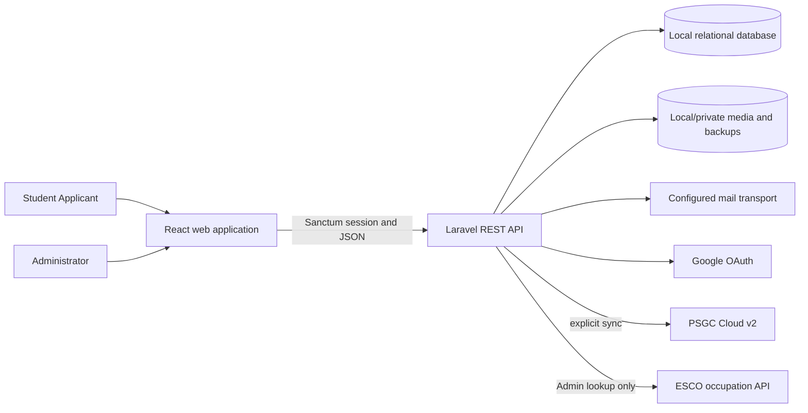

# System context

```mermaid
flowchart LR
    Student[Student Applicant] --> Web[React web application]
    Admin[Administrator] --> Web
    Web -->|Sanctum session and JSON| API[Laravel REST API]
    API --> DB[(Local relational database)]
    API --> Files[(Local/private media and backups)]
    API --> Mail[Configured mail transport]
    API --> Google[Google OAuth]
    API -->|explicit sync| PSGC[PSGC Cloud v2]
    API -->|Admin lookup only| ESCO[ESCO occupation API]
```

Laravel is the trust boundary. The browser never writes scoring, eligibility, role, ownership, or institutional source facts directly.
