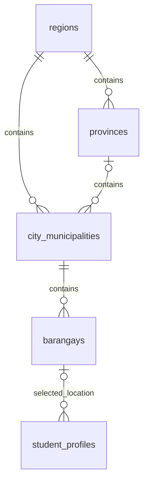

# Philippine location selection

**Decision:** APPROVED by the repository owner on 2026-09-07.
**Delivery status:** COMPLETED — implementation, live import, automated checks, and responsive browser checks passed on 2026-09-07.

## Source and boundaries

Reviewed [PSGC Cloud REST v2 documentation](https://psgc.cloud/api-docs/v2) and live responses on 2026-09-07. The sync uses the documented `/api/v2/regions`, `/provinces`, and `/cities-municipalities` collections plus `/regions/{code}` details and `/regions/{code}/barangays` collections. Live parent fields are name strings, resolved uniquely against the source catalogue; city names are scoped by region and province. Local persistence always uses IDs and PSGC codes.

Live findings:

- Collections use a `data` envelope and ten-character string codes. The inspected global lists contained 17 regions, 82 provinces, and 1,656 city/municipality/submunicipality records. These are observed source counts, not claimed current official national totals.
- The global `/barangays` endpoint returned only 100 rows. Both `page=2` and `per_page=1000` returned the same 100 rows, with no pagination metadata. The sync therefore does **not** rely on the global barangay endpoint or guessed pagination behavior.
- The documented Region I barangay endpoint returned 3,267 rows. The implementation reads region-scoped barangays and requires their length to match each region detail's `barangays_count`; incomplete collections cannot replace local data.
- **Source contradiction:** 31 NCR city/submunicipality records identify Sarangani as their province. The province catalogue places Sarangani in Region XII. NCR's detail reports `provinces_count: 0`, and `/regions/1300000000/provinces` returns an empty list. The live City of Manila detail repeats the conflicting Sarangani label.
- The importer normalizes a cross-region province label to null only when the PSGC province catalogue confirms that the record's region has no provinces. It logs the number of corrected records. A cross-region label in any region that has provinces still rejects the full atomic sync. The initial live import normalized 1,741 city/barangay records under this guard.

Fixtures use the verified live field shapes with synthetic test labels. They are never production seed data.

Laravel owns persistence, validation, authentication, and API responses. React never calls PSGC Cloud. This feature does not change assessment scoring, admission eligibility, or programme recommendations. The intentionally removed controlled documentation has not been restored.

## Run and recovery

From the repository root in PowerShell:

```powershell
Set-Location apps/api
php artisan migrate
php artisan locations:sync
```

- `locations:sync` skips upstream calls when a successful import is less than seven days old.
- `php artisan locations:sync --force` refreshes within that interval.
- The command uses a one-hour Laravel cache lock, a ten-second connection timeout, a 120-second request timeout, and at most three attempts per collection. It returns a nonzero exit code on failure.
- Configure the existing Laravel cache store normally; its project default is database caching. TTLs and timeouts are in `config/locations.php`. There is no API key or extra frontend environment variable.
- The catalogue must be complete, structurally valid, and have valid ancestry. Region-scoped barangay lists are checked against their source detail counts; duplicate, truncated, or unexpectedly paginated responses are rejected. Upserts and the catalogue-version record commit in one transaction. Failures preserve the previous catalogue and version.
- Codes remain strings, including leading zeroes. Repeated imports retain database IDs. Records absent from a later successful import become inactive instead of being deleted, preserving saved foreign keys.
- API cache entries use the successful catalogue version and a 24-hour TTL. A new import immediately uses a new cache namespace; unrelated cache entries are not flushed. Cache-store failures fall back to database reads. The last successful database catalogue remains available during upstream outages without an expiry deadline.
- Before the first successful import, location-list requests return a recoverable 503 message. Do not seed fabricated fallback locations. After a failed refresh, the last successful local catalogue remains available; inspect `storage/logs/laravel.log` for technical failure details and rerun the command.
- No scheduled task was added. A deployment may invoke the same command periodically through its existing scheduler.

## Schema and contracts



The four catalogue tables have unique PSGC codes, names, active flags, and timestamps. Cities have both a region foreign key and a nullable province foreign key; no artificial province is inserted. Barangays reference cities. `student_profiles.barangay_id` stores the canonical selected leaf; the full hierarchy is derived from its relationships. `location_syncs` records each successful version, timestamp, and resource counts. Foreign keys restrict deletion.

All endpoints require an active authenticated account, use the existing `/api/v1` prefix, and are throttled to 120 requests per minute:

| GET path after `/api/v1/locations` | `data` |
| --- | --- |
| `/regions` | Array of `{ id, code, name }` |
| `/regions/{regionId}/provinces` | `{ items: [{ id, code, name }], hasIndependentCities: boolean }` |
| `/provinces/{provinceId}/cities-municipalities` | Array of `{ id, code, name }` |
| `/regions/{regionId}/independent-cities` | Same array, restricted to cities with null province |
| `/cities-municipalities/{cityId}/barangays` | Array of `{ id, code, name }` |

Unknown or inactive parents return 404. Lists contain active local records only, sorted by name.

The existing Student profile POST/PUT accepts `location: { regionId, provinceId, cityMunicipalityId, barangayId }`. IDs must be integers, and `provinceId` is explicitly null for a province-less city. Laravel verifies every ancestor and active state; a mismatch returns a field validation error. It derives and stores the address-name snapshot from the local records, ignoring client-supplied names. Student and protected Admin profile responses include the selected IDs and barangay `code` in `location`.

Legacy address strings are retained without guessing PSGC matches. Omitting `location` preserves the existing stored address; an existing legacy address remains visible while the Student selects its structured replacement. New text-only address submissions do not write location names. The house/street/zone input remains free text under the existing encrypted profile fields.

## UI

The existing Personal information step now uses the existing shadcn Select controls in Region → Province → City or municipality → Barangay order. Changing a parent clears descendants immediately. An explicit No province option appears only when local data contains province-less cities. The draft uses `-1` for this UI choice and sends null to Laravel; `-1` is never a stored province ID. TanStack Query caches the public reference choices for 24 hours and keys requests by parent, preventing old child responses from replacing a newer parent's choices.

Loading, disabled, empty, failed-request/retry, saved-selection restoration, and legacy-address states are provided. Existing layout, typography, palette, photo upload, academic fields, and learning-profile flow are retained.

## Validation and remaining work

- **PASSED:** MySQL migrations, including the already-pending personal/academic profile migration required by the existing profile work and the new location migration.
- **PASSED:** Full Laravel suite: **111 tests, 898 assertions passed**. Coverage includes verified name-based parents, guarded hierarchy normalization, rejection of unsafe contradictions, truncated regional responses, lock exclusion, cache versions, retained IDs, and profile ownership.
- **PASSED:** PHP Pint on changed backend files.
- **PASSED:** Focused React location/profile tests: 4 tests; frontend lint; TypeScript plus production Vite build.
- **PARTIAL:** Full frontend suite: 118 passed, 4 skipped, 1 failed. The existing `src/app/theme.test.tsx` expects `rgb(255, 254, 249)` while the pre-existing dirty `src/index.css` uses white. This task did not change that CSS or weaken its test.
- **PASSED:** Playwright location workflow on desktop Chrome and mobile Chrome, using synthetic Laravel response fixtures: saved selections, parent resets, province-less selection, keyboard focus/opening, no page overflow, and axe label/ARIA/rendered-contrast checks on the location fieldset. Screenshots were visually inspected. These checks do not prove a live end-to-end PSGC import.
- **PASSED:** Initial live import: 17 regions, 82 provinces, 1,656 cities/municipalities/submunicipalities, and 42,027 barangays. `location_syncs` contains the successful version record.
- **PASSED:** Imported NCR verification: City of Manila (`1380600000`) belongs to NCR (`1300000000`) with a null province; all 31 active NCR city/submunicipality rows are province-less, and their 1,710 active barangays resolve through those records.
- **Risk:** PSGC Cloud connectivity was intermittent during verification. Failed refreshes preserve the successful local catalogue. The guarded NCR normalization should remain visible in application logs until PSGC corrects its source labels.
- **Next action:** Run `php artisan locations:sync` periodically through the deployment's existing scheduler and monitor sync failures/source warnings. Resolve the existing theme mismatch separately.

## Files changed by this task

Backend schema and models:

- `apps/api/database/migrations/2026_09_07_130000_create_location_tables.php`
- `apps/api/app/Models/Region.php`
- `apps/api/app/Models/Province.php`
- `apps/api/app/Models/CityMunicipality.php`
- `apps/api/app/Models/Barangay.php`
- `apps/api/app/Models/StudentProfile.php`

Backend sync, API, and profile integration:

- `apps/api/config/locations.php`
- `apps/api/app/Console/Commands/SyncLocations.php`
- `apps/api/app/Services/Locations/PsgcLocationSync.php`
- `apps/api/app/Services/Locations/ProfileLocation.php`
- `apps/api/app/Http/Controllers/LocationController.php`
- `apps/api/app/Http/Controllers/Student/StudentProfileController.php`
- `apps/api/app/Http/Controllers/Admin/AdminWorkspaceController.php`
- `apps/api/app/Services/Student/StudentProfilePresenter.php`
- `apps/api/routes/api.php`

Frontend:

- `apps/web/src/features/locations/location-api.ts`
- `apps/web/src/features/locations/components/location-fields.tsx`
- `apps/web/src/features/student/profile/components/student-profile-page.tsx`
- `apps/web/src/features/student/profile/student-profile-types.ts`
- `apps/web/src/features/admin/data/admin-api.ts`

Tests:

- `apps/api/tests/Feature/Locations/LocationTest.php`
- `apps/api/tests/Feature/Student/StudentProfileTest.php`
- `apps/web/src/features/locations/location-fields.test.tsx`
- `apps/web/src/features/student/profile/student-profile-page.test.tsx`
- `apps/web/e2e/student-workflow.spec.ts`

Documentation:

- `README.md`
- `DESIGN.md` (profile selection pattern only)
- `SYSTEM-IMPROVEMENT-ROADMAP.md` (decision, progress, sprint/backlog entry)
- `docs/note/2026-09-07-psgc-locations.md` (this implementation, contract, schema, changelog, validation, and file inventory)

Pre-existing uncommitted work was preserved. The earlier `2026_09_07_120000_add_personal_academic_fields_to_student_profiles_table.php` was executed as a prerequisite but was not authored or modified by this task.
